# 🌱 Smart Garden Monitoring System

A real-time garden monitoring system that demonstrates **API Polling** concepts using Flask framework. This project simulates IoT sensor data and provides a web dashboard that continuously monitors plant health through periodic API calls.


## 🎯 Project Overview

The Garden Monitoring System is designed to showcase **API Polling** - a fundamental communication pattern where a client repeatedly requests data from a server at regular intervals. This project simulates a smart garden environment where sensors monitor soil moisture, sunlight levels, and temperature.

## 📚 What is API Polling?

**API Polling** is a communication pattern where:
- **Client** periodically sends requests to a server
- **Server** responds with current data state
- **Interval** determines how frequently requests are made
- **Stateless** - each request is independent

### Polling vs Other Patterns


## 🏗️ Architecture Overview


## 🔄 API Polling Flow


## 🚀 Features

- **Real-time Monitoring**: Continuous sensor data simulation
- **API Polling**: Client-side polling every 2 minutes
- **Smart Alerts**: Threshold-based plant care recommendations
- **Responsive Dashboard**: Bootstrap-powered UI with live updates
- **Background Processing**: Simulated sensor updates every 3 minutes
- **Docker Support**: Containerized deployment ready
- **CI/CD Pipeline**: GitHub Actions workflow included

## 📊 Sensor Data Flow

```mermaid
flowchart TD
    A[Sensor Simulation Thread] --> B{Update Sensors}
    B --> C[Soil Moisture<br/>10-90%]
    B --> D[Sunlight<br/>0-100%]
    B --> E[Temperature<br/>5-35°C]
    
    C --> F[Check Thresholds]
    D --> F
    E --> F
    
    F --> G{Below Threshold?}
    G -->|Yes| H[Generate Alert]
    G -->|No| I[Status: Healthy]
    
    H --> J[API Response]
    I --> J
    
    J --> K[Frontend Polling]
    K --> L[Update Dashboard]
    
    style A fill:#ffeb3b
    style F fill:#ff9800
    style H fill:#f44336
    style I fill:#4caf50
```



## 🛠️ Installation & Setup

### Prerequisites
- Python 3.9+
- pip (Python package manager)
- Git

### Local Development Setup

1. **Clone the repository**
```bash
git clone https://github.com/yourusername/GardenMonitoringSystem.git
cd GardenMonitoringSystem
```

2. **Create virtual environment**
```bash
python -m venv envGardenMon
source envGardenMon/bin/activate  # On Windows: envGardenMon\Scripts\activate
```

3. **Install dependencies**
```bash
pip install -r requirements.txt
```

4. **Run the application**
```bash
python app.py
```

5. **Access the dashboard**
Open your browser and navigate to `http://localhost:5000`

### Docker Setup

1. **Build the Docker image**
```bash
docker build -t garden-monitoring .
```

2. **Run the container**
```bash
docker run -p 5000:5000 garden-monitoring
```

## 📁 Project Structure

```
GardenMonitoringSystem/
├── app.py                      # Main Flask application
├── templates/
│   └── dashboard.html          # Frontend dashboard
├── requirements.txt            # Python dependencies
├── Dockerfile                  # Docker configuration
├── .gitignore                  # Git ignore rules
├── .github/
│   └── workflows/
│       └── ci_cd_workflow.yml  # GitHub Actions CI/CD
└── README.md                   # This file
```

## 🔧 Configuration

### Polling Intervals
- **Frontend Polling**: 2 minutes (120,000ms)
- **Sensor Updates**: 3 minutes (180s)
- **Countdown Timer**: 1 second updates

### Alert Thresholds
```python
ALERT_THRESHOLDS = {
    'soil_moisture': 30.0,  # Water if below 30%
    'sunlight': 20.0,       # Low light warning below 20%
    'temperature': 10.0     # Too cold warning below 10°C
}
```

## 📈 API Endpoints

### GET `/`
Returns the main dashboard HTML page.

### GET `/api/garden-status`
Returns current sensor data and alerts in JSON format.

**Response Schema:**
```json
{
  "sensor_data": {
    "soil_moisture": 45.2,
    "sunlight": 78.5,
    "temperature": 22.1,
    "last_updated": "2024-01-15 14:30:22"
  },
  "alerts": ["Water me! Soil moisture is low."],
  "status": "needs_attention"
}
```

## 🎨 Frontend Polling Implementation

The dashboard implements client-side polling using vanilla JavaScript:

```javascript
const POLL_INTERVAL = 120000; // 2 minutes

function fetchGardenStatus() {
    fetch('/api/garden-status')
        .then(response => response.json())
        .then(data => updateDashboard(data))
        .catch(error => handleError(error));
}

// Poll every 2 minutes
setInterval(fetchGardenStatus, POLL_INTERVAL);
```

## 🔍 Polling Best Practices Demonstrated

1. **Reasonable Intervals**: Not too frequent (avoid server overload) or too rare (maintain freshness)
2. **Error Handling**: Graceful degradation when API calls fail
3. **User Feedback**: Visual countdown showing next poll time
4. **Efficient Updates**: Only update changed elements in DOM
5. **Background Processing**: Server continues updating data independently

## 📊 Performance Considerations

### Polling Trade-offs

| Aspect | Short Interval (30s) | Medium Interval (2min) | Long Interval (5min) |
|--------|---------------------|----------------------|-------------------|
| **Data Freshness** | High | Medium | Lower |
| **Server Load** | High | Medium | Low |
| **Battery Usage** | High | Medium | Low |
| **Network Usage** | High | Medium | Low |
| **Real-time Feel** | Excellent | Good | Adequate |

*This project uses 2-minute intervals as a balance between freshness and efficiency.*

## 🚀 Deployment

### GitHub Actions CI/CD

The project includes a complete CI/CD pipeline that:
- Tests the application on multiple Python versions
- Performs code linting with flake8
- Builds and pushes Docker images
- Deploys to production (configurable)

### Environment Variables

For production deployment, configure:
```env
FLASK_ENV=production
FLASK_DEBUG=False
PORT=5000
```

## 🤝 Contributing

1. Fork the repository
2. Create a feature branch (`git checkout -b feature/amazing-feature`)
3. Commit your changes (`git commit -m 'Add amazing feature'`)
4. Push to the branch (`git push origin feature/amazing-feature`)
5. Open a Pull Request

## 📚 Learning Outcomes

This project teaches:
- **API Polling Patterns**: Understanding when and how to implement polling
- **Flask Backend Development**: RESTful API creation and background processing
- **Frontend JavaScript**: Asynchronous requests and DOM manipulation
- **Threading in Python**: Background task management
- **Responsive Design**: Bootstrap integration and mobile-friendly interfaces
- **DevOps Practices**: Docker containerization and CI/CD pipelines

## 🔄 Alternative Patterns to Consider

While this project demonstrates polling, consider these alternatives for different scenarios:

1. **Server-Sent Events (SSE)**: For real-time updates with less overhead
2. **WebSockets**: For bi-directional real-time communication
3. **Webhooks**: For event-driven updates
4. **Message Queues**: For asynchronous processing at scale

## 🐛 Troubleshooting

### Common Issues

1. **Port already in use**: Change port in `app.py` or kill existing process
2. **Module not found**: Ensure virtual environment is activated and dependencies installed
3. **Docker build fails**: Check Docker daemon is running and Dockerfile syntax
4. **Polling stops**: Check browser console for JavaScript errors

### Debug Mode

Run with debug enabled:
```bash
export FLASK_DEBUG=1
python app.py
```

## Test
# Pylint Test : 
```pylint --disable=W,C,R app.py > errors.txt```  

## 📄 License

This project is licensed under the MIT License - see the [LICENSE](LICENSE) file for details.

## 🙋‍♂️ Support

If you have questions or need help:
- Open an issue on GitHub
- Check the troubleshooting section
- Review the code comments for implementation details

---

**Happy Gardening! 🌱** 

*Built with ❤️ to demonstrate API Polling concepts in Flask*